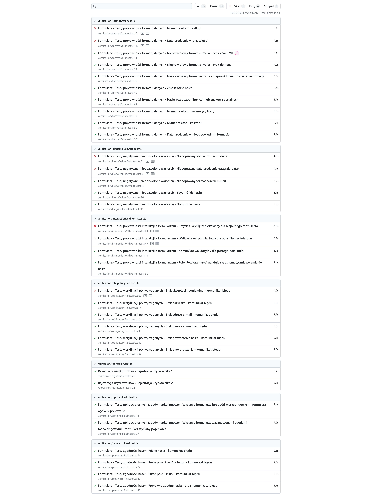

# Examples

## Run tests npm

```sh
npx playwright test --headed
```

## Run test docker

```sh
docker-compose up -d
```

#### Report

```sh
open -a safari http://localhost:81
```

###

## Run test k8s

https://hub.docker.com/r/kidackim/playwright-examples/tags

Wymagana zmiana katalogu hosta dla pv.yaml.

```yaml
hostPath:
  path: '{{.LOCAL_VIRTUAL_FILE}}'
```

```sh
cd k8s
kubectl apply -f .
```

### Uwagi

Zadanie dla mac arm potrzebuję poniszych zmian

```sh
export NODE_OPTIONS=--openssl-legacy-provider
```

Wszystkie metody uruchomienia testów

1. npm
2. docker
3. k8s

Generują raport w katalogu playwright-report/index.html

# Treść zadania

Udało mi się napisać 26 testów sprawdzających podany formularz. \
26 testów przeszło pozytywnie. \
7 uzyskało wynik negatywny.

Dla łatwiejszego przeglądania treści scenariuszy testowych umieszczam zdjęcie z wygenerowanego raportu z testów.

# Scenariusze 


### Raport z testu dostępny w pliku html

```sh
open -a "safari" playwright-report/index.html
```
